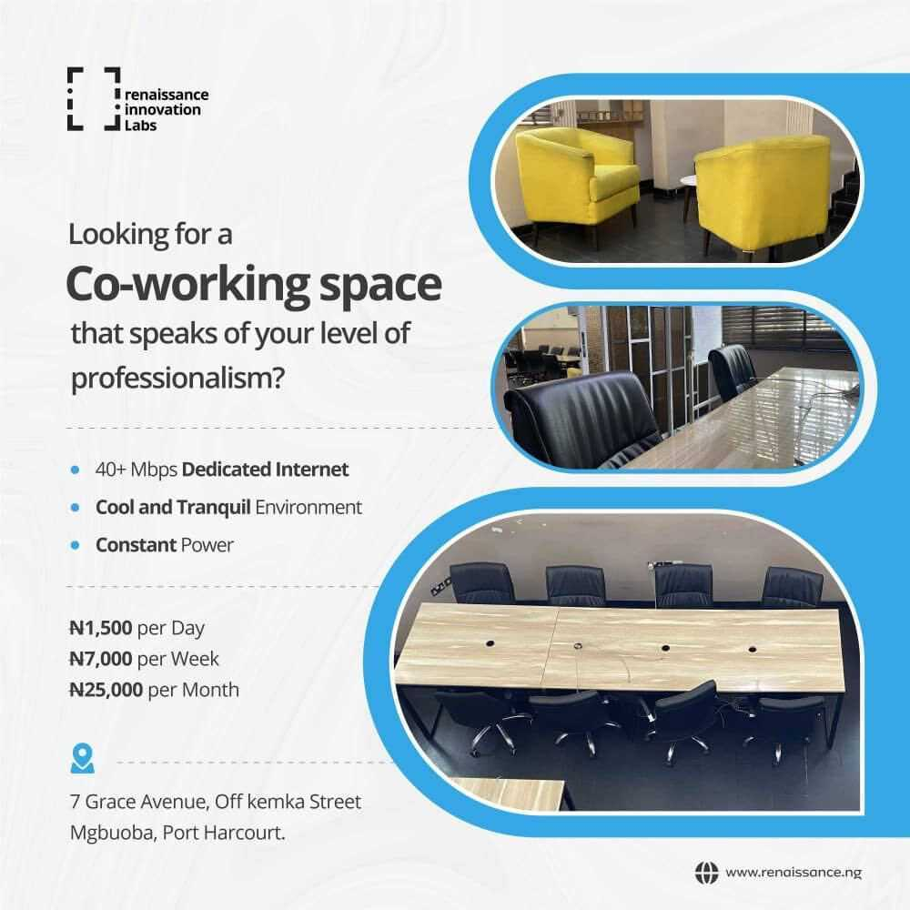

# Co-Work Space

We offer the service of a Co-Working Environment. We have really conducive office spaces, High internet Speed and Constant Power Supply designed to meet the needs of persons who desire privacy and comfort.

***(Ensure you always act by the policies, orders, rules, regulations, and guidelines from time to time)***

- Endeavor to provide the correct information in the Contact Form sent to you.
- The building would only be accessible from Monday - Friday, within the hours of 9a.m through 5pm daily.
- The use of the Workspace Internet to carry out fraudulent acts is highly prohibited. If caught, such individuals would be dealt with according to the Law.
- Relay every question or complaints to the Human Resource Manager or Facility manager.
- You must; work within a healthy and safe workplace. Avoid every act or practices that may be hazardous to your colleagues and the environment. **Say no to Unsafe Acts and Unsafe Practices.**
- *Endeavor to Always maintain proper decorum and conduct yourself in a manner that contributes to operating effectiveness, safety, and a harmonious work environment.*
- Avoid Playing loud music, kindly make use of an earpiece.
- Eating in the Workspace is not allowed. The Kitchen is always open.
- Keep personal calls brief or use the lobby not to disturb your co-work space colleagues.
- RIL Frowns at Harassment and discrimination of colleagues in and out of the workplace.
- Private Offices and Labs are off limits.
- You would be held responsible for any damage caused by you to any RIL Facility.
- Kindly Visit the HR’s Office If you wish to renew your Workspace subscription at the end of your already subscribed duration.