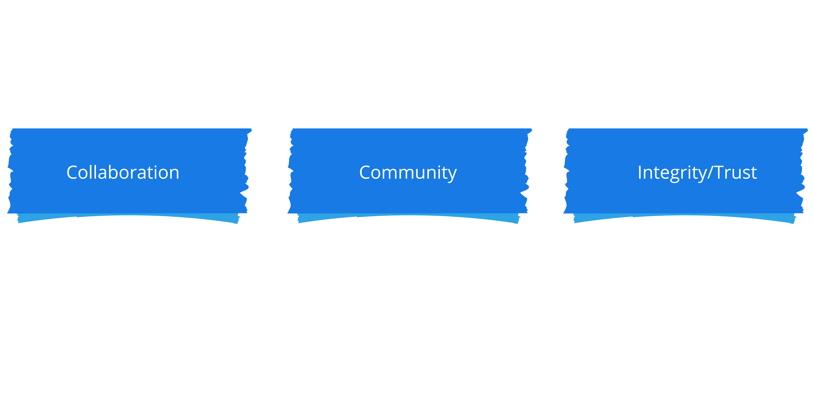
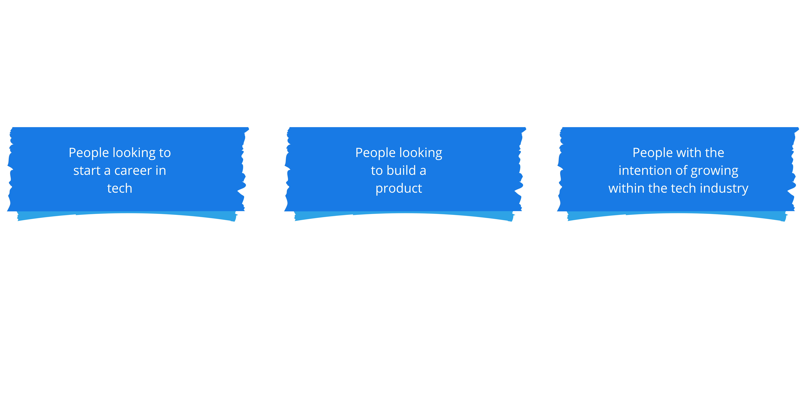
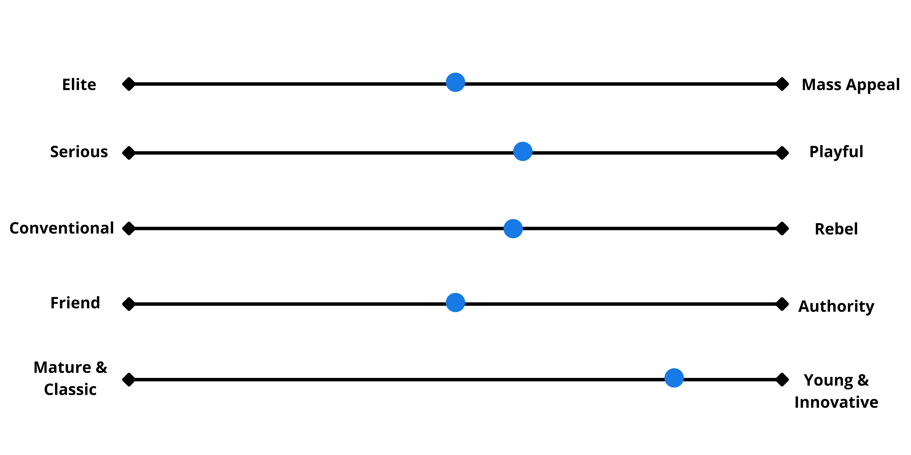
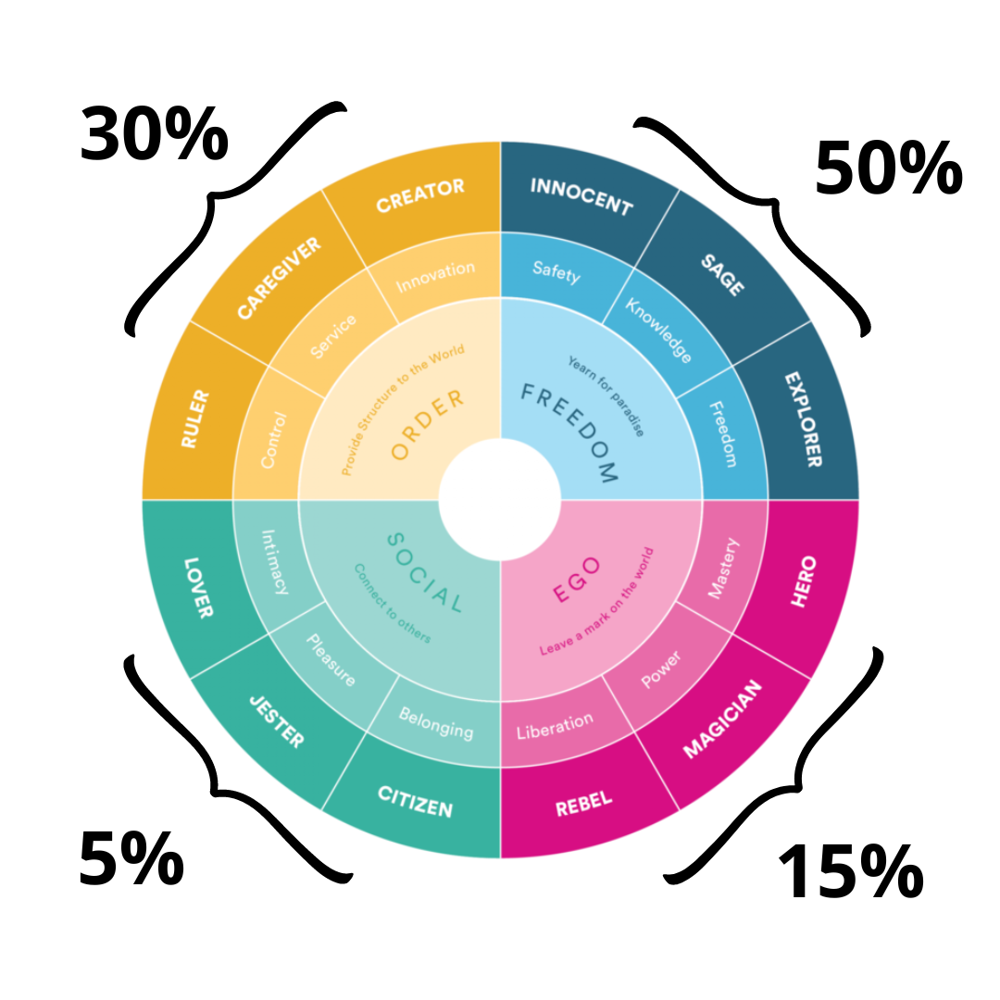

## Social Media Style Guide 

This guide serves as an aid towards improving our brand identity.  The purpose of this guide is to provide a concrete representation of RIL’s brand so that we have a common reference point when we are working on a new design, product, marketing and strategy initiatives. Should our website design be more serious or playful? Are we writing articles in a tone of voice that makes sense? These questions should be easier to answer with this guide. 

## Brand Personality

We are trying to build a unique brand personality to improve trust and loyalty.  

## Brand Tone

Our brand tone should evoke an inviting, welcoming, friendly and loyal emotion in our users. 

## Top 3 Values

We took time to redefine our values and picked out the best 3 values that define our brand. With these values, we should be able to position ourselves as thought leaders within our industry. 

 
## Top 3 Audiences

We have lined up three major people amongst others who might be interested in what we do and how we work. Everything we do in RIL will be to make these people accommodated and happy.

## Personality Slider

Almost like our tone of voice, this is how we’d like to be perceived by people. Wherever the blue dot tends to is who we’d like to be seen as. 

## Brand Archetype

## RIL Press/Media Kit

We keep a comprehensive list of media assets and guidelines for their use on the dedicated [press kit drive](https://drive.google.com/file/d/1Jp2mWiJdeG_qHfXBDxycoWLVJlPI92Yd/view?usp=share_link). 
